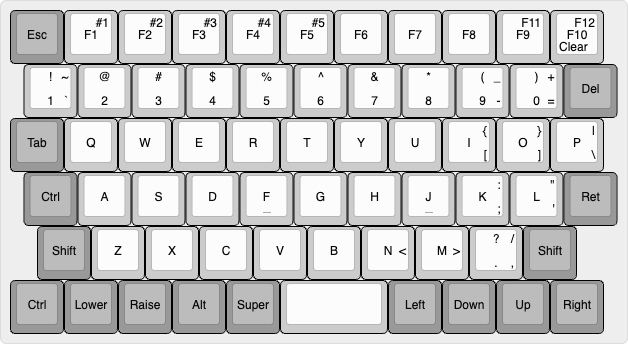

# zmk-config

ZMK configurations for the Little Luggable and PsiBoard nice!nano based keyboards

## Little Luggable

Keyboard for the [Little Luggable cyberdeck](https://github.com/jbmorley/little-luggable).

## PsiBoard
